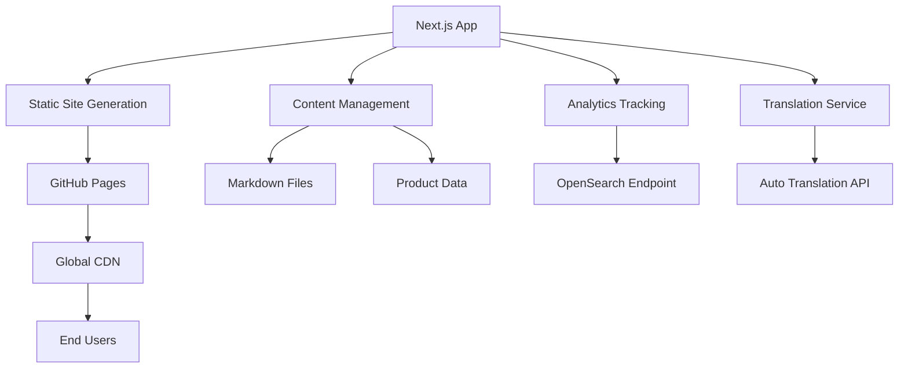

# Design Document

## Overview

The team tech blog will be built as a static Next.js application optimized for GitHub Pages hosting. The architecture leverages Next.js App Router with static site generation (SSG) to create a fast, SEO-friendly blog that supports internationalization, analytics tracking, and a product showcase.

## Architecture

### High-Level Architecture



### Technology Stack Integration

- **Next.js 14+** with App Router for modern React patterns
- **Static Export** (`output: 'export'`) for GitHub Pages compatibility
- **Tailwind CSS** for utility-first styling
- **shadcn/ui** for consistent component library
- **TypeScript** for type safety
- **MDX** for rich markdown content with React components

## Components and Interfaces

### Core Components

#### 1. Layout Components
```typescript
// app/layout.tsx - Root layout with i18n support
interface RootLayoutProps {
  children: React.ReactNode;
  params: { locale: 'ko' | 'en' };
}

// components/Header.tsx - Navigation with language switcher
interface HeaderProps {
  locale: 'ko' | 'en';
  currentPath: string;
}

// components/Footer.tsx - Site footer with links
interface FooterProps {
  locale: 'ko' | 'en';
}
```

#### 2. Blog Components
```typescript
// components/BlogPost.tsx - Individual post display
interface BlogPostProps {
  post: BlogPost;
  locale: 'ko' | 'en';
  relatedPosts?: BlogPost[];
}

// components/BlogList.tsx - Post listing with pagination
interface BlogListProps {
  posts: BlogPost[];
  currentPage: number;
  totalPages: number;
  locale: 'ko' | 'en';
}

// components/TagFilter.tsx - Tag-based filtering
interface TagFilterProps {
  tags: string[];
  selectedTag?: string;
  locale: 'ko' | 'en';
}
```

#### 3. Showcase Components
```typescript
// components/ProductCard.tsx - Product showcase item
interface ProductCardProps {
  product: Product;
  locale: 'ko' | 'en';
}

// components/ProductDetail.tsx - Detailed product view
interface ProductDetailProps {
  product: Product;
  relatedPosts: BlogPost[];
  locale: 'ko' | 'en';
}
```

#### 4. Author Components
```typescript
// components/AuthorCard.tsx - Author profile card
interface AuthorCardProps {
  author: Author;
  locale: 'ko' | 'en';
  showBio?: boolean;
}

// components/AuthorProfile.tsx - Full author profile page
interface AuthorProfileProps {
  author: Author;
  posts: BlogPost[];
  projects: Product[];
  locale: 'ko' | 'en';
}

// components/AuthorBadge.tsx - Small author display in posts
interface AuthorBadgeProps {
  author: Author;
  locale: 'ko' | 'en';
  showDate?: Date;
}
```

#### 4. Analytics Components
```typescript
// components/analytics/GoogleAnalytics.tsx - GA4 integration
export function GoogleAnalytics() {
  const gaMeasurementId = process.env.NEXT_PUBLIC_GA_MEASUREMENT_ID;
  
  useEffect(() => {
    initGA();
  }, []);
  
  return (
    <Script
      strategy="afterInteractive"
      src={`https://www.googletagmanager.com/gtag/js?id=${gaMeasurementId}`}
    />
  );
}

// hooks/useAnalytics.ts - Custom hooks for analytics
export const useAnalytics = (pageId: string) => {
  usePageView();
  useTimeSpentTracking(pageId);
  useScrollDepthTracking();
  useOutboundLinkTracking();
  
  return { trackCustomEvent };
};
```

### Page Structure

```
app/
├── [locale]/
│   ├── page.tsx                 # Homepage with recent posts
│   ├── blog/
│   │   ├── page.tsx            # Blog listing with pagination
│   │   ├── [slug]/
│   │   │   └── page.tsx        # Individual blog post
│   │   └── tag/
│   │       └── [tag]/
│   │           └── page.tsx    # Tag-filtered posts
│   ├── showcase/
│   │   ├── page.tsx            # Product showcase listing
│   │   └── [product]/
│   │       └── page.tsx        # Individual product page
│   ├── authors/
│   │   ├── page.tsx            # Team members listing
│   │   └── [author]/
│   │       └── page.tsx        # Individual author profile
│   └── about/
│       └── page.tsx            # About the team
├── api/
│   └── analytics/
│       └── route.ts            # Analytics endpoint
└── globals.css                 # Global styles
```

## Data Models

### Author Model
```typescript
interface Author {
  id: string;
  slug: string; // URL-friendly identifier
  name: {
    ko: string;
    en?: string;
  };
  avatar: string; // Profile image URL
  bio: {
    ko: string;
    en?: string;
  };
  role: {
    ko: string; // e.g., "프론트엔드 개발자"
    en?: string; // e.g., "Frontend Developer"
  };
  skills: string[]; // Technical skills/technologies
  social: {
    github?: string;
    linkedin?: string;
    twitter?: string;
    email?: string;
  };
  joinedAt: Date;
  isActive: boolean;
  projects: string[]; // Product IDs the author participated in
}
```

### Blog Post Model
```typescript
interface BlogPost {
  id: string;
  slug: string;
  title: {
    ko: string;
    en?: string; // Manually created
  };
  content: {
    ko: string;
    en?: string; // Manually created
  };
  excerpt: {
    ko: string;
    en?: string; // Manually created
  };
  authorId: string; // Reference to Author
  publishedAt: Date;
  updatedAt: Date;
  tags: string[];
  status: 'draft' | 'published';
  featuredImage?: string;
  readingTime: number;
  relatedProducts?: string[]; // Product IDs
}
```

### Product Model
```typescript
interface Product {
  id: string;
  slug: string;
  name: {
    ko: string;
    en?: string; // Manually created
  };
  description: {
    ko: string;
    en?: string; // Manually created
  };
  features: {
    ko: string[];
    en?: string[]; // Manually created
  };
  technologies: string[];
  screenshots: string[];
  demoUrl?: string;
  githubUrl?: string;
  status: 'active' | 'archived';
  createdAt: Date;
  relatedPosts?: string[]; // Blog post IDs
}
```

### Analytics Event Model
```typescript
// Google Analytics 4 Event Model
interface GAEvent {
  name: 'page_view' | 'scroll' | 'click' | 'file_download' | 'outbound_link' | 'search' | 'time_spent';
  params?: {
    page_location?: string;
    page_title?: string;
    page_referrer?: string;
    page_id?: string;
    time_spent?: number;
    scroll_depth?: number;
    link_url?: string;
    link_text?: string;
    search_term?: string;
    [key: string]: any;
  };
}
```

## Content Management Strategy

### Static Content Generation
- **Blog posts** stored as MDX files in `content/posts/`
- **Product data** stored as JSON/YAML in `content/products/`
- **Build-time processing** for static site generation
- **Automated translation** during build process

### File Structure
```
content/
├── posts/
│   ├── 2024-01-15-nextjs-optimization.ko.mdx  # Korean version
│   ├── 2024-01-15-nextjs-optimization.en.mdx  # English version (manually created)
│   ├── 2024-01-20-react-patterns.ko.mdx
│   ├── 2024-01-20-react-patterns.en.mdx
│   └── ...
├── products/
│   ├── project-alpha.ko.json
│   ├── project-alpha.en.json  # Manually created English version
│   ├── project-beta.ko.json
│   ├── project-beta.en.json
│   └── ...
├── authors/
│   ├── john-doe.ko.json        # Team member profile in Korean
│   ├── john-doe.en.json        # Team member profile in English (manually created)
│   ├── jane-smith.ko.json
│   ├── jane-smith.en.json
│   └── ...
└── translations/
    ├── common.ko.json
    ├── common.en.json
    └── ...
```

## Internationalization Design

### Translation Strategy
1. **Primary Language**: Korean (authored content)
2. **Manual Translation**: Developers create both Korean and English versions
3. **Static File Generation**: Both language versions stored as separate files
4. **i18n Integration**: Proper locale-based file routing

### Implementation Approach
```typescript
// Content files are manually created for both languages:
// content/posts/my-post.ko.mdx (Korean version)
// content/posts/my-post.en.mdx (English version)

// lib/i18n.ts - Next.js i18n configuration
const i18nConfig = {
  defaultLocale: 'ko',
  locales: ['ko', 'en'],
  localeDetection: true,
};
```

## Analytics Integration

### Analytics Integration with Google Analytics 4

**Security Approach**: Use Google Analytics 4 for analytics data collection, which provides a secure and privacy-compliant solution.

#### Google Analytics 4 Setup
```typescript
// lib/analytics.ts
'use client';

// GA4 Event Types
export type GAEventType = 
  | 'page_view'
  | 'scroll'
  | 'click'
  | 'file_download'
  | 'outbound_link'
  | 'search'
  | 'time_spent';

// Initialize Google Analytics
export const initGA = () => {
  if (typeof window === 'undefined') return;
  
  // Get GA measurement ID
  const gaMeasurementId = process.env.NEXT_PUBLIC_GA_MEASUREMENT_ID;
  
  if (!gaMeasurementId) {
    console.warn('Google Analytics Measurement ID not found');
    return;
  }
  
  // Initialize gtag
  window.dataLayer = window.dataLayer || [];
  window.gtag = function gtag() {
    window.dataLayer.push(arguments);
  };
  
  window.gtag('js', new Date());
  window.gtag('config', gaMeasurementId, {
    anonymize_ip: true, // GDPR compliance
  });
};

// Track a page view
export const trackPageView = (url: string, title?: string, referrer?: string) => {
  if (typeof window === 'undefined' || !window.gtag) return;
  
  window.gtag('event', 'page_view', {
    page_location: url,
    page_title: title || document.title,
    page_referrer: referrer || document.referrer,
  });
};
```

#### React Integration
```typescript
// hooks/useAnalytics.ts
'use client';

import { useEffect } from 'react';
import { usePathname } from 'next/navigation';
import { trackPageView, trackEvent } from '@/lib/analytics';

// Hook for tracking page views
export const usePageView = () => {
  const pathname = usePathname();
  
  useEffect(() => {
    trackPageView(pathname);
  }, [pathname]);
};

// Hook for tracking time spent
export const useTimeSpentTracking = (pageId: string) => {
  useEffect(() => {
    const startTime = Date.now();
    
    return () => {
      const timeSpentInSeconds = Math.floor((Date.now() - startTime) / 1000);
      trackEvent('time_spent', { page_id: pageId, time_spent: timeSpentInSeconds });
    };
  }, [pageId]);
};
```

#### Benefits of Google Analytics 4 Approach
- **Secure**: Industry-standard security practices
- **Simple**: No backend infrastructure to maintain
- **Scalable**: Handles billions of events
- **Comprehensive**: Rich reporting and analysis tools
- **Cost-effective**: Free for most use cases
- **Privacy-compliant**: Built-in privacy controls and anonymization

### Privacy Considerations
- **Consent management** for GDPR compliance
- **Anonymous tracking** with IP anonymization
- **Respect for Do Not Track** browser settings
- **Opt-out mechanisms** for users via UI component
- **Data retention policies** managed by Google Analytics

## Error Handling

### Language Fallbacks
- Graceful fallback to available language version
- Clear indication when content is only available in one language
- Consistent user experience across both languages

### Analytics Errors
- Graceful handling of analytics blocking (ad blockers)
- Silent failures to not impact user experience
- Fallback for offline scenarios (handled by GA4)

### Build-time Errors
- Validation of content files
- Missing translation warnings
- Broken link detection

## Testing Strategy

### Unit Testing
- Component testing with React Testing Library
- Utility function testing with Jest
- Translation service mocking

### Integration Testing
- Page rendering tests
- Analytics tracking verification (mock GA4)
- Static generation validation

### End-to-End Testing
- User journey testing with Playwright
- Cross-browser compatibility
- Mobile responsiveness testing

## Performance Optimization

### Static Site Benefits
- **Pre-rendered pages** for instant loading
- **CDN distribution** via GitHub Pages
- **Optimized assets** with Next.js built-in optimization

### Image Optimization
```typescript
// next.config.js
const nextConfig = {
  output: 'export',
  images: {
    unoptimized: true, // Required for static export
  },
  trailingSlash: true,
};
```

### Bundle Optimization
- Code splitting by route
- Dynamic imports for heavy components
- Tree shaking for unused code
- Asset compression and minification

## SEO Strategy

### Meta Tags and Structured Data
```typescript
// components/SEOHead.tsx
interface SEOProps {
  title: string;
  description: string;
  locale: 'ko' | 'en';
  canonical?: string;
  ogImage?: string;
  ogType?: 'website' | 'article';
  publishedTime?: string;
  modifiedTime?: string;
  author?: string;
  tags?: string[];
}

// Open Graph implementation
export function SEOHead({ 
  title, 
  description, 
  locale, 
  canonical, 
  ogImage,
  ogType = 'website',
  publishedTime,
  modifiedTime,
  author,
  tags 
}: SEOProps) {
  const siteUrl = 'https://your-team.github.io';
  const fullTitle = `${title} | Team Tech Blog`;
  const ogImageUrl = ogImage || `${siteUrl}/og-default.png`;
  
  return (
    <Head>
      {/* Basic Meta Tags */}
      <title>{fullTitle}</title>
      <meta name="description" content={description} />
      <meta name="language" content={locale} />
      
      {/* Open Graph Tags */}
      <meta property="og:title" content={fullTitle} />
      <meta property="og:description" content={description} />
      <meta property="og:type" content={ogType} />
      <meta property="og:url" content={canonical || siteUrl} />
      <meta property="og:image" content={ogImageUrl} />
      <meta property="og:image:width" content="1200" />
      <meta property="og:image:height" content="630" />
      <meta property="og:locale" content={locale === 'ko' ? 'ko_KR' : 'en_US'} />
      <meta property="og:site_name" content="Team Tech Blog" />
      
      {/* Article-specific OG tags */}
      {ogType === 'article' && (
        <>
          <meta property="article:published_time" content={publishedTime} />
          <meta property="article:modified_time" content={modifiedTime} />
          <meta property="article:author" content={author} />
          {tags?.map(tag => (
            <meta key={tag} property="article:tag" content={tag} />
          ))}
        </>
      )}
      
      {/* Twitter Card Tags */}
      <meta name="twitter:card" content="summary_large_image" />
      <meta name="twitter:title" content={fullTitle} />
      <meta name="twitter:description" content={description} />
      <meta name="twitter:image" content={ogImageUrl} />
      
      {/* Additional Meta Tags */}
      <meta name="robots" content="index, follow" />
      <link rel="canonical" href={canonical || siteUrl} />
      
      {/* Alternate language versions */}
      <link rel="alternate" hrefLang="ko" href={`${siteUrl}/ko${canonical?.replace(siteUrl, '') || ''}`} />
      <link rel="alternate" hrefLang="en" href={`${siteUrl}/en${canonical?.replace(siteUrl, '') || ''}`} />
      <link rel="alternate" hrefLang="x-default" href={`${siteUrl}${canonical?.replace(siteUrl, '') || ''}`} />
    </Head>
  );
}
```

### Dynamic OG Image Generation

**Template-based OG Image Strategy**: Create consistent, branded OG images using a presentation-style template.

```typescript
// lib/og-image.ts
interface OGImageTemplate {
  title: string;
  author: string;
  tags: string[];
  type: 'blog' | 'product' | 'home';
  locale: 'ko' | 'en';
  publishedDate?: string;
}

// OG Image Template Design Specs
const OG_TEMPLATE_CONFIG = {
  width: 1200,
  height: 630,
  background: {
    gradient: 'linear-gradient(135deg, #667eea 0%, #764ba2 100%)',
    // or solid color: '#1a1a1a'
  },
  branding: {
    logo: '/logo-white.svg',
    teamName: 'Team Tech Blog',
    position: 'top-right',
  },
  typography: {
    title: {
      fontSize: '48px',
      fontWeight: 'bold',
      color: '#ffffff',
      maxLines: 3,
    },
    author: {
      fontSize: '24px',
      color: '#e2e8f0',
    },
    tags: {
      fontSize: '18px',
      backgroundColor: 'rgba(255,255,255,0.2)',
      borderRadius: '20px',
      padding: '8px 16px',
    },
    date: {
      fontSize: '16px',
      color: '#cbd5e0',
    },
  },
};

// Build-time OG image generation
export async function generateOGImage(options: OGImageTemplate): Promise<string> {
  // Using @vercel/og or similar library for static generation
  const html = `
    <div style="
      width: 1200px;
      height: 630px;
      background: ${OG_TEMPLATE_CONFIG.background.gradient};
      display: flex;
      flex-direction: column;
      justify-content: center;
      align-items: center;
      padding: 60px;
      position: relative;
      font-family: 'Inter', sans-serif;
    ">
      <!-- Team Logo/Branding -->
      <div style="position: absolute; top: 40px; right: 40px; display: flex; align-items: center;">
        
        <span style="color: white; font-size: 18px; margin-left: 12px;">
          ${OG_TEMPLATE_CONFIG.branding.teamName}
        </span>
      </div>
      
      <!-- Main Content -->
      <div style="text-align: center; max-width: 900px;">
        <!-- Title -->
        <h1 style="
          font-size: ${OG_TEMPLATE_CONFIG.typography.title.fontSize};
          font-weight: ${OG_TEMPLATE_CONFIG.typography.title.fontWeight};
          color: ${OG_TEMPLATE_CONFIG.typography.title.color};
          margin: 0 0 30px 0;
          line-height: 1.2;
        ">
          ${options.title}
        </h1>
        
        <!-- Author -->
        <p style="
          font-size: ${OG_TEMPLATE_CONFIG.typography.author.fontSize};
          color: ${OG_TEMPLATE_CONFIG.typography.author.color};
          margin: 0 0 20px 0;
        ">
          by ${options.author}
        </p>
        
        <!-- Tags -->
        <div style="display: flex; justify-content: center; gap: 12px; flex-wrap: wrap;">
          ${options.tags.slice(0, 3).map(tag => `
            <span style="
              background: ${OG_TEMPLATE_CONFIG.typography.tags.backgroundColor};
              border-radius: ${OG_TEMPLATE_CONFIG.typography.tags.borderRadius};
              padding: ${OG_TEMPLATE_CONFIG.typography.tags.padding};
              font-size: ${OG_TEMPLATE_CONFIG.typography.tags.fontSize};
              color: white;
            ">
              #${tag}
            </span>
          `).join('')}
        </div>
      </div>
      
      <!-- Date (bottom) -->
      ${options.publishedDate ? `
        <div style="position: absolute; bottom: 40px; left: 40px;">
          <span style="
            font-size: ${OG_TEMPLATE_CONFIG.typography.date.fontSize};
            color: ${OG_TEMPLATE_CONFIG.typography.date.color};
          ">
            ${new Date(options.publishedDate).toLocaleDateString(options.locale === 'ko' ? 'ko-KR' : 'en-US')}
          </span>
        </div>
      ` : ''}
    </div>
  `;
  
  // Generate image and save to public/og/ directory
  const fileName = `${slugify(options.title)}-${options.locale}.png`;
  const outputPath = `public/og/${fileName}`;
  
  await generateImageFromHTML(html, outputPath);
  return `/og/${fileName}`;
}

// Usage in blog post pages
export function getOGImageForPost(post: BlogPost, locale: 'ko' | 'en'): string {
  return generateOGImage({
    title: post.title[locale] || post.title.ko,
    author: post.author.name,
    tags: post.tags,
    type: 'blog',
    locale,
    publishedDate: post.publishedAt.toISOString(),
  });
}
```

### OG Image Template Variations
```typescript
// Different templates for different content types
const OG_TEMPLATES = {
  blog: {
    background: 'linear-gradient(135deg, #667eea 0%, #764ba2 100%)',
    accent: '#4f46e5',
  },
  product: {
    background: 'linear-gradient(135deg, #f093fb 0%, #f5576c 100%)',
    accent: '#ec4899',
  },
  home: {
    background: 'linear-gradient(135deg, #4facfe 0%, #00f2fe 100%)',
    accent: '#0ea5e9',
  },
};
```

### Sitemap Generation
- Automated sitemap.xml generation
- Multi-language URL structure
- Product and blog post indexing

### URL Structure
```
Korean (default):
- /blog/nextjs-optimization
- /showcase/project-alpha

English:
- /en/blog/nextjs-optimization
- /en/showcase/project-alpha
```