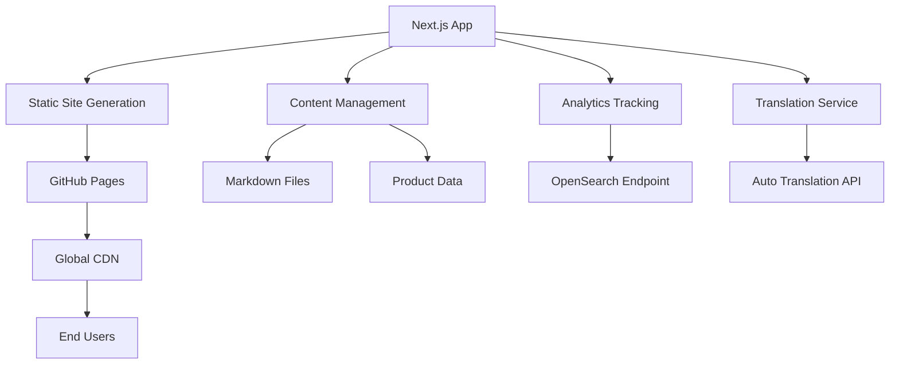

# Design Document

## Overview

The team tech blog will be built as a static Next.js application optimized for GitHub Pages hosting. The architecture leverages Next.js App Router with static site generation (SSG) to create a fast, SEO-friendly blog that supports internationalization, analytics tracking, and a product showcase.

## Architecture

### High-Level Architecture



### Technology Stack Integration

- **Next.js 14+** with App Router for modern React patterns
- **Static Export** (`output: 'export'`) for GitHub Pages compatibility
- **Tailwind CSS** for utility-first styling
- **shadcn/ui** for consistent component library
- **TypeScript** for type safety
- **MDX** for rich markdown content with React components

## Components and Interfaces

### Core Components

#### 1. Layout Components
```typescript
// app/layout.tsx - Root layout with i18n support
interface RootLayoutProps {
  children: React.ReactNode;
  params: { locale: 'ko' | 'en' };
}

// components/Header.tsx - Navigation with language switcher
interface HeaderProps {
  locale: 'ko' | 'en';
  currentPath: string;
}

// components/Footer.tsx - Site footer with links
interface FooterProps {
  locale: 'ko' | 'en';
}
```

#### 2. Blog Components
```typescript
// components/BlogPost.tsx - Individual post display
interface BlogPostProps {
  post: BlogPost;
  locale: 'ko' | 'en';
  relatedPosts?: BlogPost[];
}

// components/BlogList.tsx - Post listing with pagination
interface BlogListProps {
  posts: BlogPost[];
  currentPage: number;
  totalPages: number;
  locale: 'ko' | 'en';
}

// components/TagFilter.tsx - Tag-based filtering
interface TagFilterProps {
  tags: string[];
  selectedTag?: string;
  locale: 'ko' | 'en';
}
```

#### 3. Showcase Components
```typescript
// components/ProductCard.tsx - Product showcase item
interface ProductCardProps {
  product: Product;
  locale: 'ko' | 'en';
}

// components/ProductDetail.tsx - Detailed product view
interface ProductDetailProps {
  product: Product;
  relatedPosts: BlogPost[];
  locale: 'ko' | 'en';
}
```

#### 4. Analytics Components
```typescript
// components/Analytics.tsx - Client-side tracking
interface AnalyticsProps {
  pageId: string;
  referrer?: string;
}

// hooks/usePageTracking.ts - Custom hook for page analytics
interface PageTrackingData {
  pageId: string;
  timeSpent: number;
  referrer: string;
  userFlow: string[];
}
```

### Page Structure

```
app/
├── [locale]/
│   ├── page.tsx                 # Homepage with recent posts
│   ├── blog/
│   │   ├── page.tsx            # Blog listing with pagination
│   │   ├── [slug]/
│   │   │   └── page.tsx        # Individual blog post
│   │   └── tag/
│   │       └── [tag]/
│   │           └── page.tsx    # Tag-filtered posts
│   ├── showcase/
│   │   ├── page.tsx            # Product showcase listing
│   │   └── [product]/
│   │       └── page.tsx        # Individual product page
│   └── about/
│       └── page.tsx            # About the team
├── api/
│   ├── analytics/
│   │   └── route.ts            # Analytics endpoint
│   └── translate/
│       └── route.ts            # Translation service
└── globals.css                 # Global styles
```

## Data Models

### Blog Post Model
```typescript
interface BlogPost {
  id: string;
  slug: string;
  title: {
    ko: string;
    en?: string; // Auto-translated
  };
  content: {
    ko: string;
    en?: string; // Auto-translated
  };
  excerpt: {
    ko: string;
    en?: string;
  };
  author: {
    name: string;
    avatar?: string;
    bio?: string;
  };
  publishedAt: Date;
  updatedAt: Date;
  tags: string[];
  status: 'draft' | 'published';
  featuredImage?: string;
  readingTime: number;
  relatedProducts?: string[]; // Product IDs
}
```

### Product Model
```typescript
interface Product {
  id: string;
  slug: string;
  name: {
    ko: string;
    en?: string;
  };
  description: {
    ko: string;
    en?: string;
  };
  features: {
    ko: string[];
    en?: string[];
  };
  technologies: string[];
  screenshots: string[];
  demoUrl?: string;
  githubUrl?: string;
  status: 'active' | 'archived';
  createdAt: Date;
  relatedPosts?: string[]; // Blog post IDs
}
```

### Analytics Event Model
```typescript
interface AnalyticsEvent {
  eventId: string;
  sessionId: string;
  pageId: string;
  eventType: 'page_view' | 'page_exit' | 'click' | 'scroll';
  timestamp: Date;
  referrer?: string;
  userAgent: string;
  timeSpent?: number;
  scrollDepth?: number;
  metadata?: Record<string, any>;
}
```

## Content Management Strategy

### Static Content Generation
- **Blog posts** stored as MDX files in `content/posts/`
- **Product data** stored as JSON/YAML in `content/products/`
- **Build-time processing** for static site generation
- **Automated translation** during build process

### File Structure
```
content/
├── posts/
│   ├── 2024-01-15-nextjs-optimization.mdx
│   ├── 2024-01-20-react-patterns.mdx
│   └── ...
├── products/
│   ├── project-alpha.json
│   ├── project-beta.json
│   └── ...
└── translations/
    ├── common.ko.json
    ├── common.en.json
    └── ...
```

## Internationalization Design

### Translation Strategy
1. **Primary Language**: Korean (authored content)
2. **Secondary Language**: English (auto-translated)
3. **Translation Service**: Integration with translation API
4. **Fallback**: Display Korean if translation fails

### Implementation Approach
```typescript
// lib/i18n.ts
interface TranslationConfig {
  defaultLocale: 'ko';
  locales: ['ko', 'en'];
  translationService: 'google' | 'papago' | 'custom';
}

// utils/translate.ts
async function translateContent(
  content: string,
  from: 'ko',
  to: 'en'
): Promise<string> {
  // Auto-translation logic
}
```

## Analytics Integration

### OpenSearch Integration
```typescript
// lib/analytics.ts
interface AnalyticsConfig {
  endpoint: string;
  index: string;
  batchSize: number;
  flushInterval: number;
}

class AnalyticsTracker {
  private events: AnalyticsEvent[] = [];
  
  track(event: Partial<AnalyticsEvent>): void;
  flush(): Promise<void>;
  trackPageView(pageId: string): void;
  trackTimeSpent(pageId: string, duration: number): void;
}
```

### Privacy Considerations
- **Consent management** for GDPR compliance
- **Anonymous tracking** by default
- **Opt-out mechanisms** for users
- **Data retention policies**

## Error Handling

### Translation Errors
- Graceful fallback to original Korean content
- Error logging for failed translations
- Retry mechanisms for temporary failures

### Analytics Errors
- Offline queue for failed requests
- Exponential backoff for retries
- Silent failures to not impact user experience

### Build-time Errors
- Validation of content files
- Missing translation warnings
- Broken link detection

## Testing Strategy

### Unit Testing
- Component testing with React Testing Library
- Utility function testing with Jest
- Translation service mocking

### Integration Testing
- Page rendering tests
- Analytics tracking verification
- Static generation validation

### End-to-End Testing
- User journey testing with Playwright
- Cross-browser compatibility
- Mobile responsiveness testing

## Performance Optimization

### Static Site Benefits
- **Pre-rendered pages** for instant loading
- **CDN distribution** via GitHub Pages
- **Optimized assets** with Next.js built-in optimization

### Image Optimization
```typescript
// next.config.js
const nextConfig = {
  output: 'export',
  images: {
    unoptimized: true, // Required for static export
  },
  trailingSlash: true,
};
```

### Bundle Optimization
- Code splitting by route
- Dynamic imports for heavy components
- Tree shaking for unused code
- Asset compression and minification

## SEO Strategy

### Meta Tags and Structured Data
```typescript
// components/SEOHead.tsx
interface SEOProps {
  title: string;
  description: string;
  locale: 'ko' | 'en';
  canonical?: string;
  ogImage?: string;
}
```

### Sitemap Generation
- Automated sitemap.xml generation
- Multi-language URL structure
- Product and blog post indexing

### URL Structure
```
Korean (default):
- /blog/nextjs-optimization
- /showcase/project-alpha

English:
- /en/blog/nextjs-optimization
- /en/showcase/project-alpha
```